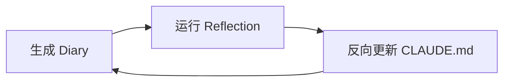

# 张磊的 Claude Code 使用心得

**分享信息**：

- 分享人：张磊
- 分享日期：2026-03-12
- 分享场合：会议分享

---

## 一、AI 编程战略与培训规划

### 战略目标与资源保障

- **核心目标**：26 财年末实现 AI 生成代码占 Git 提交总量的 50%
- **影响**：AI 编程将成为程序员基础技能，直接影响招聘与竞争力
- **战略整合**：将 AI 编码能力纳入组织核心能力指标

**四大支柱**：

- 新赛道布局：引领 AI 代码趋势
- AI 编程能力竞争：提升竞争优势
- 人才培养与储备：AI 人才发展策略
- 组织保障：确保必要基础设施与支持

**资源保障（多源支持）**：

- 已采购智谱大模型服务，计划接入阿里云、腾讯云、火山引擎
- 确保员工 TOKEN 使用自由，无供给瓶颈
- 构建弹性、多供应商的 AI 算力底座

---

## 二、Claude Code 工具实战应用

### 2.1 记忆管理（CLAUDE.md）

- **长期记忆**：从项目根目录启动，自动生成 `CLAUDE.md` 作为长期记忆
- **层级记忆**：project > user > folder，优先级明确
- **管理原则**：控制在 300–500 行，定期更新，避免信息过载
- **价值**：用结构化记忆提升 AI 上下文理解力

Claude Code 可自动收集项目相关信息（日志、技术架构、部署参数等），推荐 Markdown 生成 900–8000 字，作为 `.claude/root.md` 等项目知识文件。

### 2.2 高效交互（快捷操作）

- **模式切换**：Shift+Tab 切换模式，90% 时间用 Plan Mode
- **错误处理**：ESC 打断错误流程，双击 ESC 重试上一条指令
- **上下文控制**：context 查看占比 >60% 时手动 compact 压缩
- **会话管理**：主动控制会话状态，避免 AI 漂移
- **会话恢复**：`resume` 命令可恢复历史会话，context 通常保留约 2K tokens

### 2.3 MCP 工具集成（精准调用）

- **明确指令**：「使用 TAPD 查询需求」等清晰指令可提升成功率
- **字段限制**：限制返回字段，如仅获取 ID 和 name
- **会话隔离**：高消耗查询用独立 session，隔离主工作流
- **目标**：让 AI 工具调用像写代码一样精准可控

MCP 服务可提供 API 接口（HTTP、Playwright），支持动态调整 context，仅在 session 达到一定阈值时开放 context 访问。

### 2.4 插件识别与多模态支持

- 支持上报 AI 模型性能，通过本地链接引用与外部智能体交互
- AI 可准确识别并优先处理解决方案需求

### 2.5 会话结束与 Diary

每次会话结束自动生成 diary 摘要，感知并匹配上下文信息，为 Self-improving 机制提供输入。

---

## 三、安全与协作机制

### 3.1 密钥与注入防护（零信任）

- **API Key 管理**：按项目创建 API Key，演示后立即删除
- **泄露防范**：提交前检查 SK 开头密钥泄露风险
- **第三方 Skill 防护**：禁用第三方 skill 中的 HTML 注释与零宽字符
- **原则**：安全不是选择，是开发流程的默认配置

**密钥保护原则**：API Key 仅限项目内使用，提交代码前必须移除。

### 3.2 技能共享与沉淀（版本化）

- **版本控制**：项目级 memory 与 skill 纳入 Git 版本控制
- **资产管理**：私有配置存于 `.user`，公共资产自动化分发
- **技能库**：构建企业级 skill library，支持增删改查
- **目标**：把技能当代码管理，让经验可复用、可传承

**多人协作**：项目记忆与技能纳入版本控制，私有配置本地存储，公共资产内部管理。

---

## 四、Self-improving 完整设计思路

让 AI 在使用中不断学习，形成组织智能。从工具使用升级为组织智能：让 AI 编码能力成为团队的可进化资产，而非一次性技能。

### 4.1 AI 能力进化闭环



| 阶段   | 说明 |
| ------ | ---- |
| **E 生成 Diary** | 每次会话结束自动记录任务摘要、设计决策与关键操作（经验留存） |
| **Q 运行 Reflection** | 周期性分析多篇 diary，提炼高置信度操作模式（模式识别） |
| **C 反向更新** | 将提炼规则自动写入 `CLAUDE.md`，优化 AI 上下文理解（持续进化） |

### 4.2 完整流程（Shell 脚本逻辑）

```shell
每次会话结束
    ↓ /diary
  结构化日记文件 (~/.claude/memory/diary/YYYY-MM-DD-session-N.md)
  · 任务摘要 / 完成工作 / 设计决策
  · 用户偏好 / 代码风格 / PR 反馈
  · 遇到的问题和解决方案

    ↓ /reflect (定期，默认分析最近 10 条未处理日记)
  模式识别与评估
  · 频率过滤：出现 1 次 → 忽略，2 次 → 候选，3+ 次 → 高置信写入
  · 规则分级：Global (~/.claude/CLAUDE.md) vs Project-Specific (项目/CLAUDE.md)
  · Violation Detection：发现已有规则被违反 → 强化而非新增（加 ZERO TOLERANCE、上移优先级）
  · 去重：processed.log 记录已处理日记，避免重复分析

    ↓ 自动写入
  CLAUDE.md 更新
  · ~/.claude/CLAUDE.md        ← 跨项目通用规则
  · [project]/CLAUDE.md        ← 项目专属规则
  · processed.log 追加记录
```

### 4.3 自我优化机制要点

- **会话摘要**：会话结束自动生成 diary 摘要
- **规则提炼**：定期运行 reflection 脚本，从 diary 提炼高置信规则
- **反向更新**：将提炼规则写入 `CLAUDE.md`，持续优化 AI 行为
- **学习目标**：让 AI 在使用中不断学习，形成组织智能

---

## 五、文献与参考

- [Hugging Face Daily Papers](https://huggingface.co/papers) — AI 研究论文每日更新
- [Prompt Engineering Guide](https://www.promptingguide.ai/) — Prompt 工程与 LLM 交互最佳实践

---

*从工具使用升级为组织智能：让 AI 编码能力成为团队的可进化资产，而非一次性技能。*
