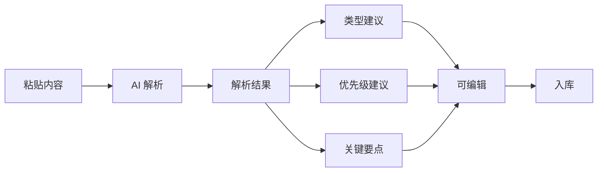

# 迭代计划：AI 信息录入工具

## 一、目标

在现有 AI 智能录入能力基础上，增强为完整的 **AI 信息录入工具**，实现：

1. **自动识别关键信息**：从输入内容中提取核心字段，并补充 AI 建议的关键信息
2. **自动分类**：AI 建议内容类型（tips/models/tools/editors/team/dingtalk）
3. **区分优先级展示**：支持优先级字段，列表按优先级排序，高优先级内容突出展示

---

## 二、现状分析

### 已有能力

| 模块 | 现状 |
|------|------|
| `lib/ai-parse.ts` | DeepSeek 解析，提取 title、summary、tags、author、shareDate、shareEvent、externalUrl，输出 `suggestedType` |
| `ParsePanel`（管理后台） | 粘贴内容 → 选择 hint(link/meeting/auto) → 解析 → 编辑 → 入库 |
| 数据模型 | `ContentItem` 无 priority 字段 |
| 展示顺序 | 首页按 `updatedAt` 降序；知识库按 JSON 数组顺序（插入顺序） |

### 差距

1. **关键信息**：可增加「关键要点」「适用场景」等 AI 建议字段
2. **分类**：已有 suggestedType，但 ParsePanel 默认用当前 tab 类型，未突出 AI 建议
3. **优先级**：无 priority，无法按重要性排序和展示

---

## 三、迭代方案

### 阶段一：数据模型与 AI 解析增强

#### 1.1 扩展 ContentItem 与 ParseResult

**`types/content.ts`** 新增可选字段：

```ts
export type Priority = "high" | "medium" | "low";

export interface ContentItem {
  // ... 现有字段
  priority?: Priority;       // 优先级，默认 medium
  keyPoints?: string[];     // 可选：关键要点（AI 提炼）
}
```

**`lib/ai-parse.ts`** 扩展 ParseResult 与 Prompt：

- 在 prompt 中要求输出 `priority`（high/medium/low）和 `keyPoints`（字符串数组）
- 判断逻辑：高价值/时效性强/团队推荐 → high；一般分享 → medium；参考性内容 → low
- 若 LLM 未返回，默认 `priority: "medium"`，`keyPoints: []`

#### 1.2 API 兼容

- `POST /api/content`、`PUT /api/content/[id]` 支持 `priority`、`keyPoints`
- 历史数据无 priority 时，视为 `medium`，排序时 high > medium > low

---

### 阶段二：录入工具 UI 增强

#### 2.1 优化 ParsePanel 展示

**解析结果区**：

- 突出展示 AI 建议的 **类型**：`suggestedType` 带标签高亮，默认选中，可切换
- 新增 **优先级** 选择器：展示 AI 建议的 priority，支持手动修正
- 可选展示 **关键要点**：keyPoints 以列表形式展示，可编辑/增删

**流程图**：



#### 2.2 独立「AI 信息录入」入口（可选）

- 在管理后台或首页增加独立入口：「AI 录入」
- 或保留现有「AI 智能录入」按钮，增强 ParsePanel 即可

---

### 阶段三：优先级展示

#### 3.1 排序规则

统一排序逻辑（`lib/data.ts` 或各调用处）：

```
优先级：high > medium > low（同优先级按 updatedAt 降序）
```

可封装为：

```ts
export function sortByPriorityAndDate(items: ContentItem[]): ContentItem[]
```

#### 3.2 应用范围

| 页面 | 变更 |
|------|------|
| 知识库 `/kb` | 各分类列表按 priority + updatedAt 排序 |
| 首页 `HomeContent` | tipsWithDingtalk 等按 priority + updatedAt 排序 |
| 管理后台列表 | 按 priority + updatedAt 排序，可选「按优先级筛选」 |
| 搜索页 | 结果按 priority 加权或排序 |

#### 3.3 视觉区分

- **ArticleCard / ShareCard 等**：高优先级项显示徽章（如「推荐」「高优」）
- 或高优卡片加左边框/背景色区分

---

### 阶段四：关键信息展示（可选）

- 若采用 `keyPoints`，可在卡片或详情页展示「要点」列表
- 搜索时可将 keyPoints 加入检索字段

---

## 四、文件变更清单

| 文件 | 变更 |
|------|------|
| `types/content.ts` | 新增 `Priority` 类型，`ContentItem` 增加 `priority?`、`keyPoints?` |
| `lib/ai-parse.ts` | ParseResult 增加 priority、keyPoints；prompt 扩展 |
| `app/api/content/route.ts` | POST 支持 priority、keyPoints |
| `app/api/content/[id]/route.ts` | PUT 支持 priority、keyPoints |
| `app/admin/(protected)/page.tsx` | ParsePanel 展示 suggestedType 高亮、priority 选择器、keyPoints 编辑 |
| `lib/data.ts` | 新增 `sortByPriorityAndDate()`，或在各 `getContent` 调用处排序 |
| `app/kb/page.tsx` | 对 items 按 priority + updatedAt 排序 |
| `app/page.tsx` | tipsWithDingtalk 等按 priority + updatedAt 排序 |
| `components/ArticleCard.tsx` | 可选：高优先级徽章 |
| `components/ShareCard.tsx` | 可选：高优先级徽章 |
| `data/*.json` | 历史数据可保持无 priority，运行时按 medium 处理 |

---

## 五、优先级字段定义建议

| 值 | 含义 | 展示 |
|----|------|------|
| high | 重点推荐、时效性强、团队必读 | 置顶或徽章「推荐」 |
| medium | 常规有价值内容 | 默认 |
| low | 参考性、过时参考 | 后排展示 |

AI 判断示例（可在 prompt 中说明）：

- **high**：团队分享的重点案例、新工具/新方法首发、关键问题解决方案
- **medium**：一般技巧、工具介绍、会议纪要
- **low**：历史参考、已过时内容、补充材料

---

## 六、实施顺序

1. **阶段一**：types、ai-parse、API 支持 priority/keyPoints
2. **阶段二**：ParsePanel UI 增强
3. **阶段三**：各页面排序与视觉区分
4. **阶段四**（可选）：keyPoints 展示与检索

---

## 七、验收标准

- [ ] 粘贴内容后，AI 解析能输出 suggestedType、priority，入库可保存
- [ ] 管理后台可编辑并选择 priority
- [ ] 知识库、首页列表按 priority（high 优先）再按 updatedAt 排序
- [ ] 高优先级内容在卡片上有明显视觉区分（徽章或样式）
- [ ] 历史无 priority 数据展示正常，视为 medium
